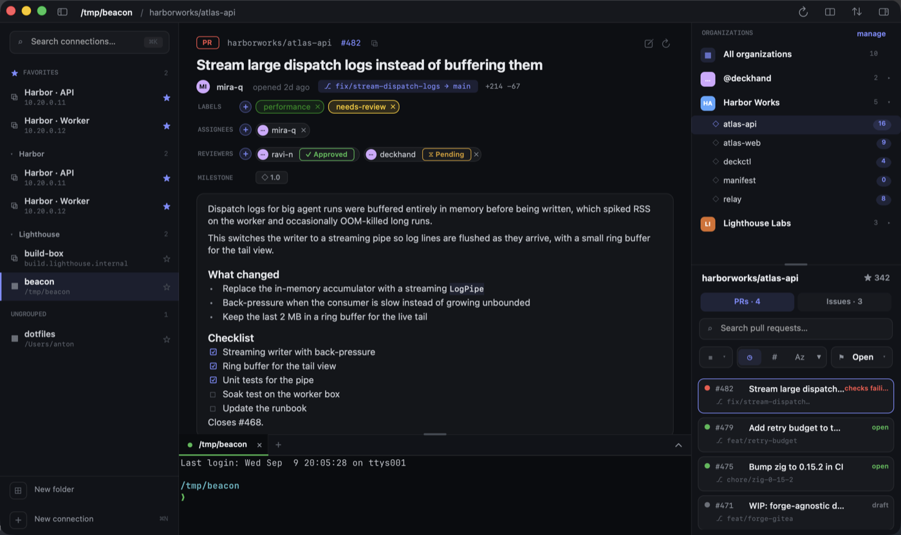

# Bosun

**Bosun** is a macOS console for working with GitHub and coding agents. It has a connection
rail you can collapse, a pane that shows issues and pull requests, a tree of organizations and
repositories, themes you can switch between, and a terminal that stays open and can be resized.
The terminal is powered by real [libghostty](https://github.com/ghostty-org/ghostty) and drawn
with Metal.



## Features

* **Connection rail**: SSH remotes and local folders. You can collapse it to save space.
* **Detail pane**: shows an issue or pull request with its checks, tasks, and comments.
* **Repositories**: a tree of organizations and repositories with their pull requests and issues.
* **Themes**: Operator, Carbon, Nord, and Daylight.
* **Terminal**: built in, drawn with Metal, and resizable.

## Install

Bosun ships through a [Homebrew tap](https://github.com/pilothouse/homebrew-bosun):

```sh
brew tap pilothouse/bosun
brew trust pilothouse/bosun
brew install --cask bosun
```

Or in one line, without tapping first:

```sh
brew install --cask pilothouse/bosun/bosun
```

Note the three parts in that second form. `pilothouse/bosun` on its own names the tap, not something
you can install, so `brew install pilothouse/bosun` will not work.

**About the trust step.** Recent Homebrew refuses to load anything from a third-party tap until you
say you trust it, and without it you get `Refusing to load cask pilothouse/bosun/bosun from untrusted
tap`. It is Homebrew asking whether you trust code from outside its official repositories, which is a
fair question about any tap, including this one. `brew trust` answers it once for the whole tap.

**Requirements:** macOS 13 Ventura or newer, on Apple Silicon. The build is a single arm64 slice, so
the cask refuses to install on an Intel Mac rather than leaving you with an app that won't launch.

Builds installed this way are signed with a Developer ID certificate and notarized by Apple, so they
open normally — no right-click-Open, no quarantine command.

On first launch Bosun asks you to sign in to GitHub. It uses the OAuth **device flow** — the app
shows a code, you enter it at [github.com/login/device](https://github.com/login/device), and no
password or token is ever typed into Bosun. It requests `read:org repo read:user`, and the resulting
token is kept in your login Keychain, never on disk in the clear. Revoke it any time from GitHub's
[authorized OAuth apps](https://github.com/settings/applications).

Bosun updates itself through Sparkle, and the cask declares `auto_updates true` so `brew upgrade`
won't fight an app that has already moved itself ahead. To remove it:

```sh
brew uninstall --cask bosun          # the app
brew zap --cask bosun                # ...and its settings, caches and saved connections
```

## Layout

The code follows Clean Architecture. The build itself enforces the boundaries:
the compiler (SPM target graph) plus SwiftLint. Dependencies point inward:
`Bosun → Infrastructure → Application → Domain`.

* `Sources/Domain/`: entities and pure rules (e.g. `DispatchPolicy`). Depends on nothing.
* `Sources/Application/`: use cases and the ports (protocols) they talk through.
* `Sources/Infrastructure/`: adapters that implement those ports (SSH, storage, and so on).
* `Sources/Bosun/`: the App layer. It holds the composition root and the
  AppKit/Metal/libghostty UI, and it is the only layer that links libghostty.
* `Sources/CGhostty/`: a small C layer that exposes the libghostty header to Swift.
* `Sources/Bosun/Ghostty/`: the libghostty bridge (`GhosttyApp`, `GhosttySurfaceView`).
* `Sources/Bosun/Views/`: the AppKit interface (titlebar, rail, detail, repo panel, terminal).
* `Sources/Bosun/{Theme,Model,Store}.swift`: themes, data models, and interface state.

## Build

The app is a SwiftPM package. Build the libghostty archive once, then run it:

```sh
bash scripts/build-libghostty.sh --check   # verify prerequisites only (fast); builds nothing
bash scripts/build-libghostty.sh           # creates Vendor/libghostty.a (several minutes)
swift run Bosun
```

The build needs **full Xcode** and the **Metal Toolchain**, which you download once with
`xcodebuild -downloadComponent MetalToolchain` (ghostty compiles its Metal shaders at build time).
Run `--check` first: it confirms the Metal toolchain can compile, reports what is present,
and exits non-zero with the exact fix if anything is missing.

### Testing the UI offline

`swift test` runs the contract tests (Domain/Application/Infrastructure). To try the *running*
app without signing in, and without the Keychain password dialog that a rebuild otherwise
triggers, launch it in UI-test mode. It seeds deterministic GitHub data and connections,
fully offline:

```sh
BOSUN_UI_TEST=1 swift run Bosun
```

`scripts/ui-verify.sh` drives the same mode as an offline smoke test; its header, and the one in
`scripts/perf-sim.sh`, cover what gets seeded and how the perf and API-smoke flags relate.

Pinned versions: zig 0.15.2, ghostty v1.3.1, macOS 15.5 SDK. The top of
`scripts/build-libghostty.sh` documents the macOS-26/zig workarounds and why each version is
pinned. The script is idempotent, and everything it creates under `Vendor/` stays out of git.

## Running an unreleased build

For something newer than the latest release, every successful CI run on `master` produces a
ready-to-run `Bosun.dmg`. Open the repo's **Actions** tab, open the latest **CI** run, and download
the **Bosun-dmg** artifact (you need to be signed in to GitHub). Unzip it, open the `.dmg`, and
drag **Bosun** to Applications.

Unlike a release, CI builds are **ad-hoc signed and not notarized**, so on first launch Gatekeeper
says it "cannot be opened". The Developer ID key is never given to CI; releases are signed and
notarized by hand. For a CI artifact, clear the quarantine once: right-click the app and choose
**Open**, or run:

```sh
xattr -dr com.apple.quarantine /Applications/Bosun.app
```

It is a single-architecture build for the CI runner's arch (Apple Silicon / arm64). You can
produce the same bundle locally from a release build with `bash scripts/package-app.sh`, which
writes `dist/Bosun.dmg`. That gives you an ad-hoc build too. Notarizing needs the maintainer's
Developer ID key and notary credentials, neither of which lives in this repo.
